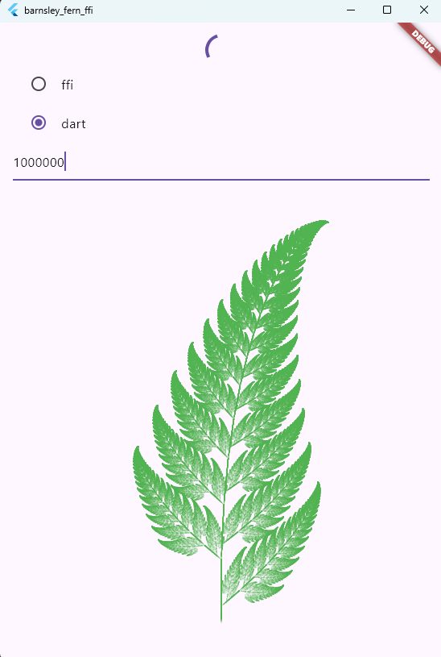

# Barnsley Fern FFI Demo

This is a Flutter project created to demonstrate the use of Dart's Foreign Function Interface (FFI).

## Overview

The project showcases how to integrate native C code with a Flutter application. It implements the [Barnsley Fern](https://en.wikipedia.org/wiki/Barnsley_fern) fractal generation algorithm.

The project is split into two main parts:

1.  **Native C Code (`/plugins/c_plugin/src`)**:
    *   A C function implements the Barnsley Fern algorithm.
    *   This function iteratively calculates the coordinates of the points that form the fractal.
    *   It exposes a function that can be called from Dart to get these points.

2.  **Flutter/Dart Application (`/lib`)**:
    *   Uses the `dart:ffi` library to load the compiled C library and look up the native function.
    *   Calls the C function to get the fern's points.
    *   Uses a `CustomPainter` to render the points on the screen, visualizing the Barnsley Fern.

This project serves as a practical example for developers looking to learn how to leverage native code performance within their Flutter apps using Dart FFI.
